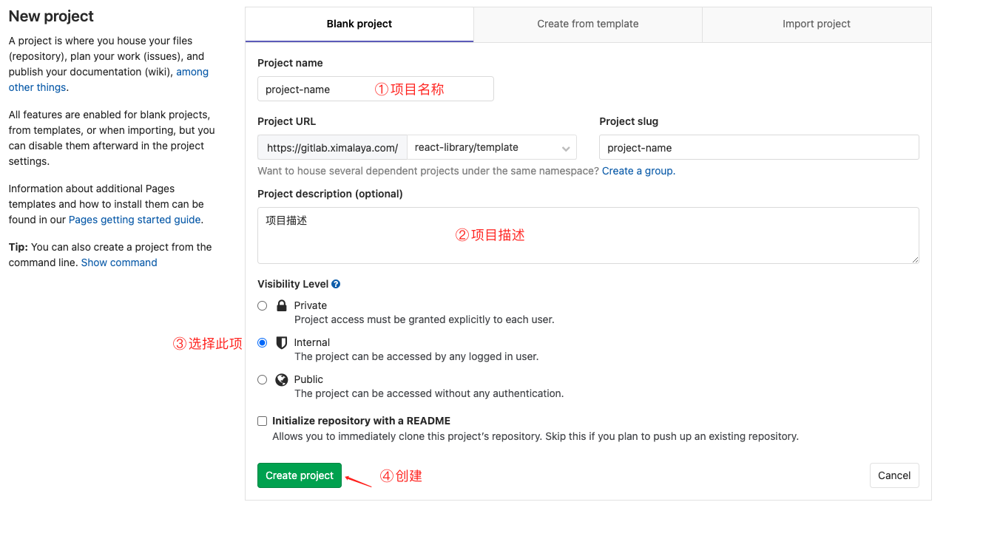
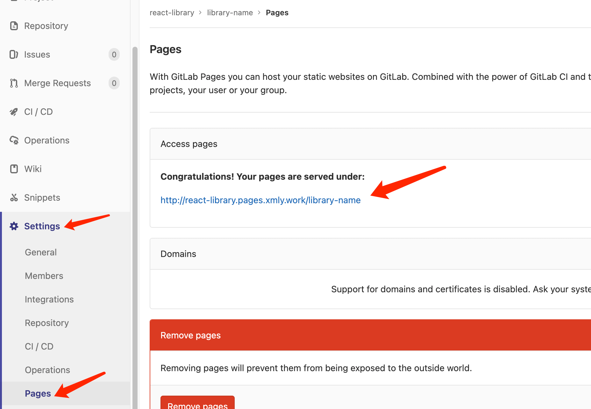
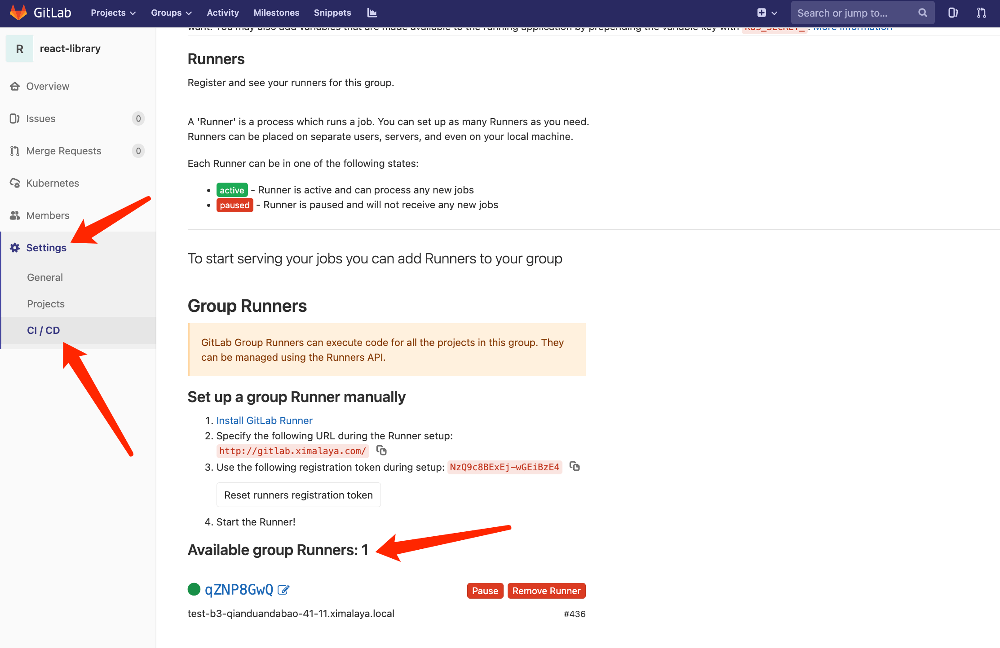

# 生产模版

可基于现有项目快速生成模版，项目复用不再成为难事

## 命令

先进入项目目录，再执行以下命令：

### 普通模式

```bash
npx -p @xmly/create-project create-project transform [模板名]
```

对应的目录结构：

<Tree>
  <ul>
    <li>
      docs <small>文档存放目录</small>
    </li>
    <li>
      template <small>模板的文件目录</small>
      <ul>
        <li>gitignore <small>注意：gitignore文件没有句号</small></li>
        <li> ... <small>其他文件</small></li>
      </ul>
    </li>
    <li>.dumirc.ts <small>dumi文档配置文件</small></li>
    <li>.editorconfig <small>编辑器风格配置</small></li>
    <li>.gitignore</li>
    <li>.gitlab-ci.yml <small>文档CI/CD</small></li>
    <li>.prettierignore <small>prettier忽略文件配置</small></li>
    <li>.prettierrc <small>prettier规则配置文件</small></li>
    <li>package.json</li>
    <li>README.md</li>
    <li>template.json</li>
    <li>tsconfig.json <small>ts配置文件</small></li>
  </ul>
</Tree>

### lerna 模式

支持生成 `lerna` 多包管理的形式：

```bash
npx -p @xmly/create-project create-project transform [模板名] -l
```

对应的目录结构：

<Tree>
  <ul>
    <li>
      docs <small>文档存放目录</small>
    </li>
    <li>
      packages
      <small>lerna项目管理</small>
      <ul>
        <li>
          template-name
          <small>模板名称</small>
          <ul>
            <li>
              template <small>模板的文件目录</small>
              <ul>
                <li>gitignore <small>注意：gitignore文件没有句号</small></li>
                <li> ... <small>其他文件</small></li>
              </ul>
            </li>
            <li>package.json</li>
            <li>README.md <small>可选</small></li>
            <li>template.json</li>
          </ul>
        </li>
      </ul>
    </li>
    <li>.dumirc.ts <small>dumi文档配置文件</small></li>
    <li>.editorconfig <small>编辑器风格配置</small></li>
    <li>.gitignore</li>
    <li>.gitlab-ci.yml <small>文档CI/CD</small></li>
    <li>.prettierignore <small>prettier忽略文件配置</small></li>
    <li>.prettierrc <small>prettier规则配置文件</small></li>
    <li>lerna.json <small>lerna配置</small></li>
    <li>package.json</li>
    <li>README.md</li>
    <li>tsconfig.json <small>ts配置文件</small></li>
  </ul>
</Tree>

## 在 gitlab 中创建项目仓库，然后关联本地代码

```bash
git remote add origin gitlab仓库地址
git add .
yarn commit
git push -u origin master
```

## 发布模版到 npm

```bash
yarn pub
```

执行命令后会自动将模版发布到内网 npm 中（前提是设置了喜马 xnpm 源）

## gitlab 仓库

为方便开发者存放代码，提供了专门的 [GitLab Group](https://gitlab.ximalaya.com/react-library/template)

创建对应 Project 仓库：



仓库创建完成后，和项目进行关联即可

## 关于文档

### markdown 编写规范

编写合适的说明文档，可以让使用者接入你的模版。以下是 markdown 编写的常用写法，希望可以帮助到你

#### 1.标题

```
# 一级标题
## 二级标题
### 三级标题
#### 四级标题
##### 五级标题
###### 六级标题
```

#### 2.换行

```
段落1<br>段落2

段落3


段落4
```

段落 1<br>段落 2

段落 3

段落 4

#### 3.字体样式

`加粗`

```
**加粗**

__字体加粗__
```

**加粗**

**字体加粗**

`斜体`

```
*字体倾斜*

_字体倾斜_
```

_字体倾斜_

_字体倾斜_

`加粗并斜体`

```
***粗斜***

___粗斜___
```

**_粗斜_**

**_粗斜_**

`删除线`

```
~~删除我吧~~
```

~~删除我吧~~

#### 4.分割线

```
---
_ _ _
***
* * *
```

---

---

---

---

#### 5.列表

`无序列表`

```
* 1
  * 2
    *3
- 4
  - 5
    - 6
+ 7
  + 8
    + 9
```

- 1
  - 2
    - 3

* 4
  - 5
    - 6

- 7
  - 8
    - 9

`有序列表`

```
1. 1
2. 2
3. 3
```

1. 1
2. 2
3. 3

#### 6.区块引用

```
> 这是一个区块引用

> 这是另一个区块引用
>> 这是一个二级嵌套引用
>>> 这是一个三级嵌套引用


> 这是另一个区块引用

>> 这是一个二级嵌套引用

>>> 这是一个三级嵌套引用
```

> 这是一个区块引用

> 这是另一个区块引用
>
> > 这是一个二级嵌套引用
> >
> > > 这是一个三级嵌套引用

> 这是另一个区块引用

> > 这是一个二级嵌套引用

> > > 这是一个三级嵌套引用

#### 7.链接

`行内式`

```
[链接](https://lianjie.com)
```

[链接](https://lianjie.com)

`参数式`

```
这是我的[blog],我想看到我的中文提示[我的博客](http;//myblog.com "我的博客")


[blog]: http;//myblog.com "我的博客"
```

这是我的[blog],我想看到我的中文提示[我的博客](http;//myblog.com '我的博客')

[blog]: http;//myblog.com '我的博客'

`自动链接`

Markdown 支持以比较简短的自动链接形式来处理网址和电子邮件信箱，只要是用<>包起来， Markdown 就会自动把它转成链接。一般网址的链接文字就和链接地址一样，例如：

```
<http://example.com/>
<address@example.com>
```

<http://example.com/>

<address@example.com>

#### 8.图片

用法跟链接的基本一样，唯一的不同就是，图片前面要写一个！

`行内式`

```

```


`参数式`

```
这是参数式的引用![我的logo]

[我的logo]: https://static.oschina.net/uploads/user/1808/3617290_100.jpeg?t=1523231638000 "我的开源中国博客logo"
```

这是参数式的引用![我的logo]

[我的logo]: https://static.oschina.net/uploads/user/1808/3617290_100.jpeg?t=1523231638000 '我的开源中国博客logo'

#### 9.代码块

`单行代码块`

```
`<p>这是一个代码块</p>`
```

`<p>这是一个代码块</p>`

`多行代码块`

````md
```ts
import './button.less';
import { Button } from './button';

export default Button;
```
````

```ts
import './button.less';
import { Button } from './button';

export default Button;
```

#### 10.表格

```
|  姓名 | 年龄 |  性别 |
|:-----|-----:|:-----:|
|Kevin |  18  |   男  |
|Jack  |  17  |   女  |
|Bruce |  19  |   男  |
```

| 姓名  | 年龄 | 性别 |
| :---- | ---: | :--: |
| Kevin |   18 |  男  |
| Jack  |   17 |  女  |
| Bruce |   19 |  男  |

#### 11.转义

转义就是将一些特殊字符转换成正常显示的样子，和大多数编程语言相同使用反斜杠(\\)表示

```
* \\
* \`
* \*
* \!
```

- \\
- \`
- \*
- \!

### 文档部署

项目中创建 `.gitlab-ci.yml` 并写入如下代码，即可在 `push` 代码时自动部署文档：

```yml
pages:
  stage: deploy
  script:
    - pwd
    - ls
    # 因为，服务器端的 nodejs 版本较低 & fsevents 不兼容 linux（仅仅是 macos 需要而已）
    # ☞ 设置略过环境检查，保证 gitlab ci 顺利执行
    - yarn config set ignore-engines true
    - yarn
    - yarn build
    - rm -rf public/*
    - mkdir .public
    - cp -r dist/* .public
    - mv .public public
  artifacts:
    paths:
      - public
  only:
    - master
```

将代码 `push` 到 gitlab 仓库后，会自动部署文档至 gitlab 仓库对应的 pages 地址，查看路径：`Seetings - Pages`



如果代码没有放在专门提供的 [GitLab Group](https://gitlab.ximalaya.com/react-library/template)中，请确保当前你的 `gitlab` 仓库支持 `CI/CD`。

### 开通 CI/CD

如果你的 `gitlab` 仓库不支持 `CI/CD`，可参考[GitLab Pages 自动部署文档、静态网站](http://ops.ximalaya.com/developer/article/164)

配置 CI/CD 的 `Runners` 可以找基础架构部-运维组 陈浩 帮忙处理


