# 脚手架可视化工具

随着脚手架和模板项目的不断增多，团队成员需要记忆的命令也越来越多。这样的情况使得管理和使用脚手架资产变得更具挑战性。为了提高团队的工作效率和开发体验，现在提供了桌面可视化工具来管理团队的脚手架资产。

桌面可视化工具提供了一个直观友好的用户界面，让团队成员能够轻松地浏览和选择适合的脚手架和模板项目。通过图形界面，用户可以一目了然地了解可用的选项、功能和定制配置，而无需记忆复杂的命令和参数。

通过使用桌面可视化工具，团队成员可以更高效地使用脚手架资产，减少出错的机会，并且能够更专注于实际的开发工作。这样的工具大大简化了团队开发流程，提升了团队的协作效率和项目交付速度。

## 下载地址

[点我下载：](https://aod.cos.tx.xmcdn.com/storages/630a-audiofreehighqps/F1/F2/GKwRIW4JUKQ3ABAAAAKL3MVw.dmg)
https://aod.cos.tx.xmcdn.com/storages/630a-audiofreehighqps/F1/F2/GKwRIW4JUKQ3ABAAAAKL3MVw.dmg

## 安装

### 1、下载完成后，双击进行安装

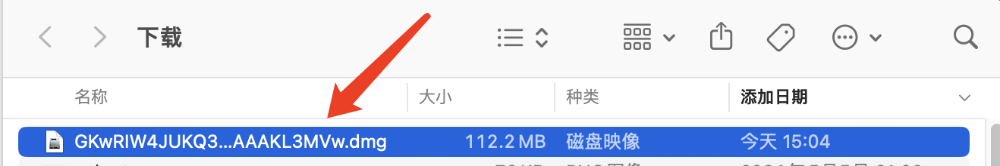

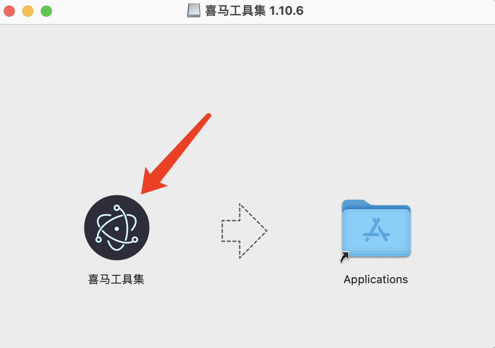

### 2、安装完成后，打开应用即可使用

<!-- 如果出现以下提示是因为应用属于第三方软件，点击取消即可，然后按照以下步骤打开：

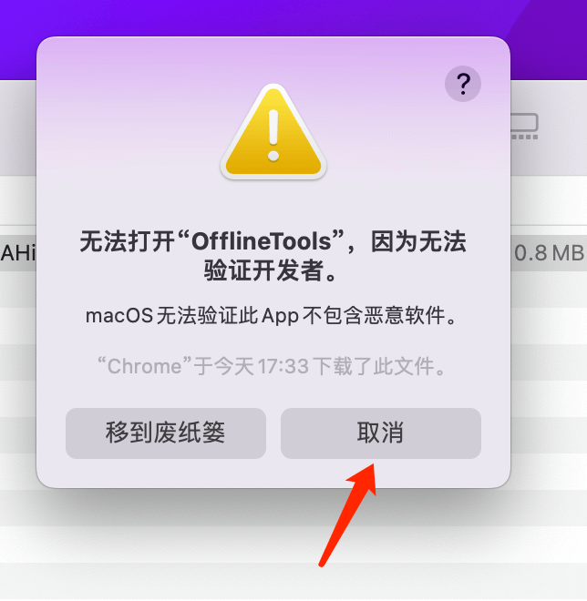

打开系统偏好设置 - 安全性与隐私 - 通用 - 点击 “仍要打开”

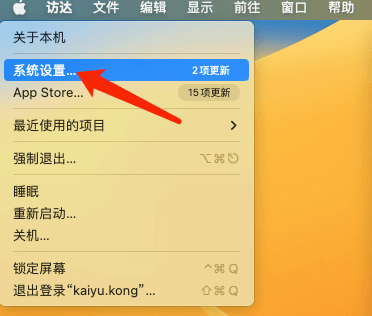

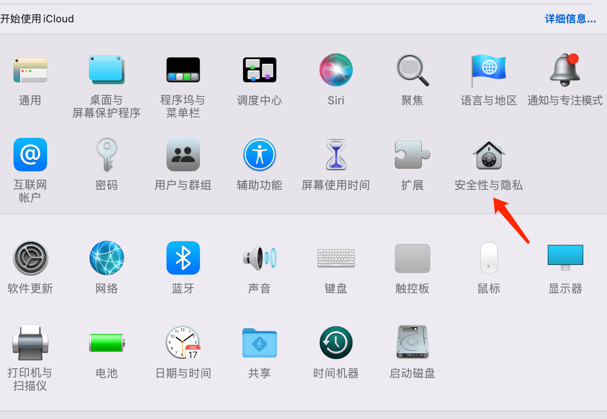

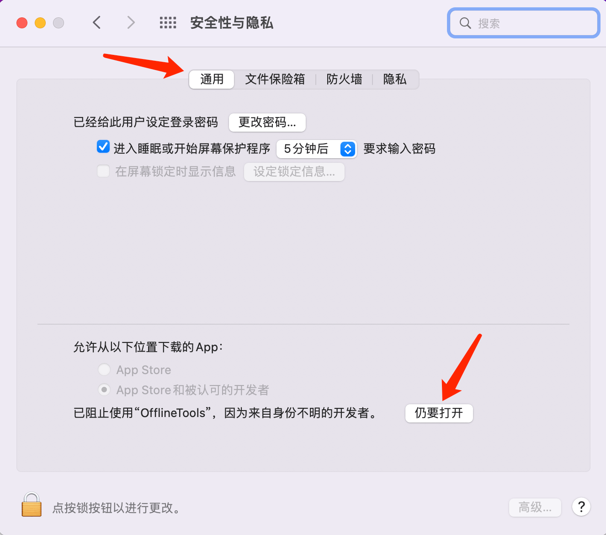 -->

## 通过脚手架创建项目

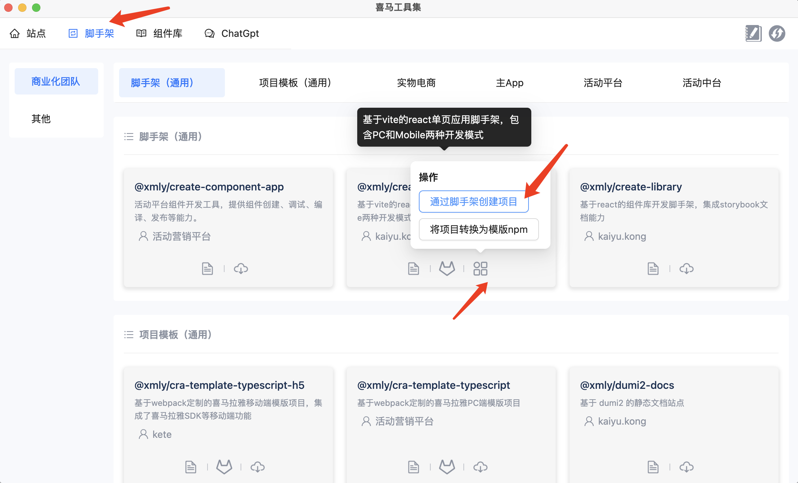

点击 `创建按钮`，选择 `项目存放目录`，点击 `确认` 按钮即可创建

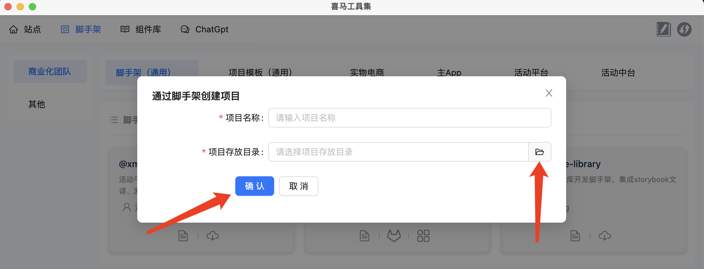

授权系统权限

## 将项目转换为模版 npm

点击 `将项目转换为模版npm`

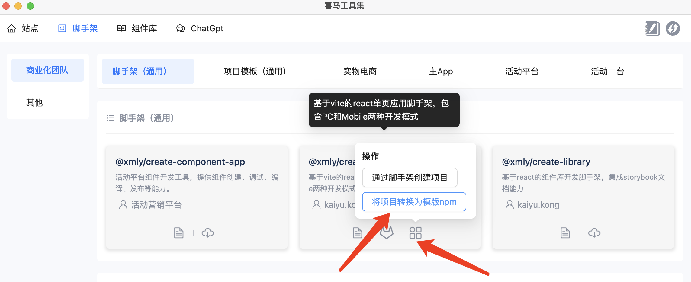

选择 `待转换项目目录`，点击 `确认` 按钮即可进行转换

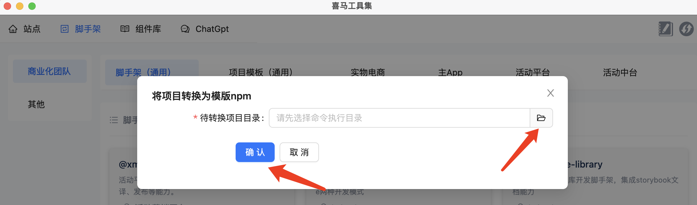

转换完成：

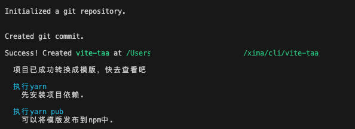
